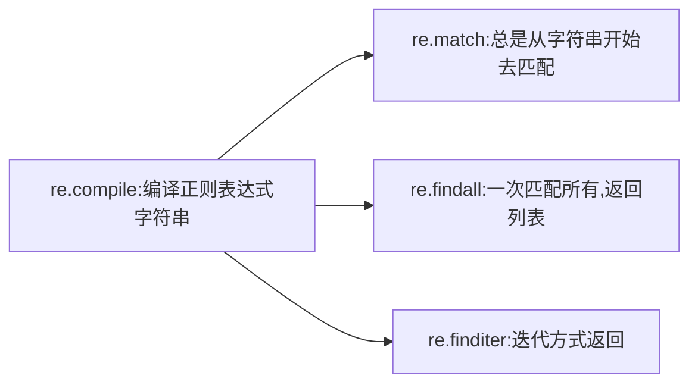
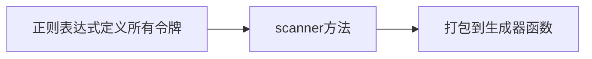
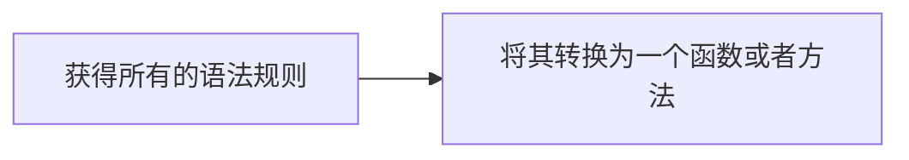

### 字符串文本操作

#### 编码问题（py3）

**本质上来说，编码和解码就是Python中str和bytes这两种字符串类型之间的互相转换**

python3默认字符是Unicode

str	： 包含Unicode字符，有一个方法是 encode()，转化成bytes类型

bytes   ：8位值，方法是 decode() ，转化成str类型

```python
s='测试'
b=s.encode('utf-8')
>>> b
b'\xe6\xb5\x8b\xe8\xaf\x95'

# 本质是按utf-8

s= b.decode(encoding='utf-8')
>>> s
'测试'
```


参考    [知乎 张雨萌的回答](https://www.zhihu.com/question/26921730)

​			[unicode相关](https://blog.csdn.net/weixin_42232219/article/details/89369259)


#### 字符串拆分拼接

##### 拆分

- 基础方法

    ```python
    'a,b,c,d'.split(',')
    >>> ['a','b','c','d']
    ```

- 进阶  re.splite()模块

    ```python
    import re
    line='test,est;ddd,eee fff'
    
    >>> re.split(r'[;,\s]',line)					# 按;, \s(空格) 分割
    >>> re.split(r'([;])',line)						# 把;提取出来， '前面部分',';','后面部分'
    >>> re.split(r'(?:[;])',line)					# 不保留';', '前面部分','后面部分'
    ```

##### 拼接

 - ```python
    ''.join(list)
    ```

 - ```python
    string1 + ' ' + string2
    ```

> 使用加号 (+) 操作符去连接大量的字符串的时候是非常低效率的，因为加号连接会引起内存复制以及垃圾回收操作。
>
> ```python
> # 错误示范
> s = ''
> for p in parts:
> s += p
> ```

> ```python
> # 比较好的写法
> data=['test',26,'test2',65]
> ','.join(str(x) for x in data)
> ```

> IO操作和字符串拼接时的性能考量
>
> ```python
> f.write(string1+string2)
> 
> f.write(string1)
> f.write(string3)
> ```
>
> 性能考量:  当s1，s2较短时，+引起的临时空间较小，合并时间开销也小，此时相较于io性能考虑，第一钟比较好。反正s1，s2较大时，后者更好。


#### 字符串匹配查找与替换

##### 简单匹配

- 切片匹配，缺点是硬编码

    > 一种解决方案，采用切片对象，消除硬编码 ，[跳转](#补充：切片对象)

- 一些基础函数

    ```python
    # 开头结尾匹配
    strname.startswith('match.what')
    strname.endswith('match.what')
    strname.startswith(('http:','https:','ftp:'))		# 元组
    
    # shell通配符
    from fnmatch import fnmatch,fnmatchcase
    >>> fnmatch('a.txt','*.txt')				# 大小写敏感取决于系统底层
    True
    >>> names = ['Dat1.csv', 'Dat2.csv', 'config.ini', 'foo.py']
    >>> [for name in names if fnmatchcase(name,'Dat')]		# 严格区分大小写
    ['Dat1.csv', 'Dat2.csv']
    ```

##### 正则匹配

```python
import re
```



- 将 模式字符串 预编译成 模式对象    [匹配过程重复使用时]

    ```python
    datepat=re.compile(r'(\d+)/(\d+)/(\d+)$')
    ```

    > r' ' 用法：匹配字段前加r之后，原字符串不需要解析\，，没r需要 \\ \ 双反斜杠

    > 正则：
    >
    > ​		+：匹配1次或者多次
    >
    > ​		*：匹配0次或者多次
    >
    > ​		?：非贪心，只匹配一次 或者0次
    >
    > ```python
    > (.*) 贪婪匹配最长				(.*?) 非贪婪 最短匹配
    > # 实现换行匹配
    > comment=re.compile(r'/\*(.*?)\*/') # 失败例子
    > comment=re.compile(r'/\*((?:.|\n)*?)\*/') # (?: 点或者\n) 因为.不能匹配换行 
    > ```

- 匹配

    ```python
    m=datepat.match('string')
    m=datepat.findall('string')
    m=datepat.finditer('string')
    # 直接使用的情况
    m=re.match(r'(\d+)/(\d+)/(\d+)$',text)
    ```

##### 替换和删除

###### 替换

```python
# 简单替换
text='string test'
text.replace('test','succeed')
# re中的sub()
text = 'Today is 11/27/2012. PyCon starts 3/13/2013.'
>>> re.sub(r'(\d+)/(\d+)/(\d+)', r'\3-\1-\2', text)
'Today is 2012-11-27. PyCon starts 2013-3-13.'
# 回调函数
具体遇到再说，目测短期不会碰到这种需求
```

###### 删除

```python
' string '.strip()
' string '.lstrip()
' string '.rstrip()
'---string===='.strip('-')
```

###### 字符串审查清理

```python
# 基础操作
str.upper()
str.lower()
str.replace('A','') or str.sub()

# 正式用法
str.translate(remap)
# 创建remap字典
remap={									# 手动
    ord('\t'):' ',
    ord('\r'):None,
    ord('A'):'B'
}

import unicodedata,sys
remap=dict.fromkeys(c for c in range(sys.maxunicode) if unicodedata.combining(chr(c)))
```


#### 格式化输出

```python
'{name} got {m} messages'.format(name='jack',m=10)
```

> 拓展   .format_map() 用于搭配 var( ) 接收变量域

3.6之后推荐以下

```python
varname = 'test'
f'this is the string {varname}'
```


#### html & Xml 处理

相关库补充


#### 令牌流解析



#### 递归下降解析器 补充 编译原理相关-解析器编译器原理实现



推荐解析工具 PyParsing 或者 PLY


